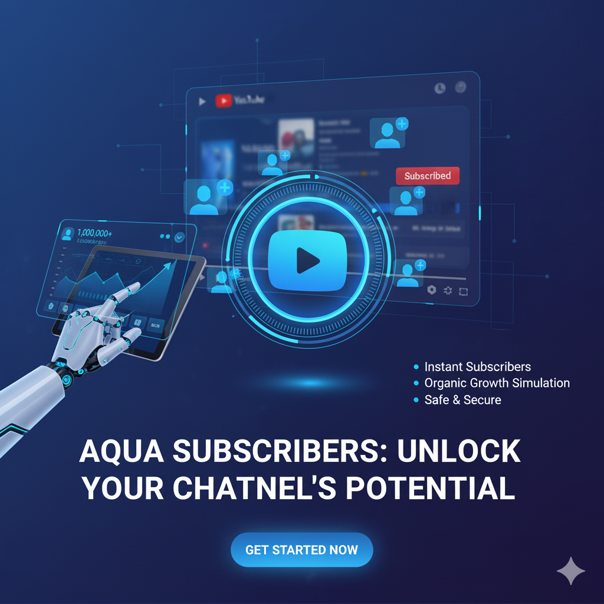
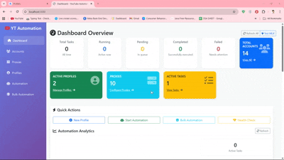

# youtube subscriber bot

Automate safe, human-like subscription workflows on YouTube for testing, QA, and controlled growth experiments. This repo gives you a modular toolkit (CLI + API) to orchestrate multi-profile sessions, proxies, and action pacing.

<p align="center"> 
  <a href="https://github.com/yourusername/youtube sub bot">
    
  </a> 
</p>

<p align="center">
  <a href="https://discord.gg/vBu9huKBvy">
    
  </a>
  <a href="https://t.me/devpilot1">
    
  </a>
</p>

## Introduction
**youtube sub bot** is a browser-automation toolkit for YouTube subscription flows. Built for growth teams, SDET/QA engineers, and researchers who need reproducible, rate-limited, multi-profile actions with logs and an optional REST API. It focuses on stability, observability, and safety controls—not spammy blast behavior.

**Key Benefits**
- **Time-saving:** one command to spin up N sessions with rotating profiles & proxies.  
- **Scalable:** run headless workers horizontally via Docker or PM2.  
- **Safer:** randomized human-like delays, jitter, per-account caps, and error backoff.

## Features
- Headless/headed runs via **Playwright** (Node) or **Selenium** (Python) adapters.  
- Profile management (local JSON, GoLogin/AdsPower adapters, or basic cookies).  
- Proxy rotation + geo rules; per-run concurrency limits with queue.  
- Action pacing (randomized wait, scroll, dwell) to mimic human behavior.  
- CLI + lightweight REST API server for programmatic control.  
- Structured logs (JSON), run summaries, and retry/backoff policies.  
- .env-driven config with per-profile overrides.

<p align="center">
  
</p>


<p align="center">
  <a href="https://www.loom.com/share/b7734cf1455f4c018e469ee18a821c72" target="_blank" rel="noopener noreferrer">
    
  </a>
</p>
<p align="center">
  <a href="https://www.loom.com/share/b7734cf1455f4c018e469ee18a821c72" target="_blank" rel="noopener noreferrer">
    Click here to see the demo video
  </a>
</p>

## Use Cases
- QA testing of subscription UX across geos and device fingerprints.  
- Controlled growth experiments with compliance-friendly rate limits.  
- Internal tooling to verify channel discovery and funnel steps.  
- Lab/demo environments to showcase automation orchestration patterns.

## Contact
<p align="center">
  <a href="https://discord.gg/vBu9huKBvy">
    
  </a>
  <a href="https://t.me/devpilot1">
    
  </a>
</p>

---

## Installation Instructions

### Pre-requisites
- **Node.js** ≥ 18 and **npm** or **pnpm**
- **Python** ≥ 3.10 (optional Python worker)
- **Docker** (optional, for containerized runs)
- **Git**
- (Optional) **GoLogin/AdsPower** if using external profile managers
- Proxies (HTTP/SOCKS) if required

### Clone
```bash
git clone "https://github.com/yourusername/youtube sub bot"
cd "youtube sub bot"
